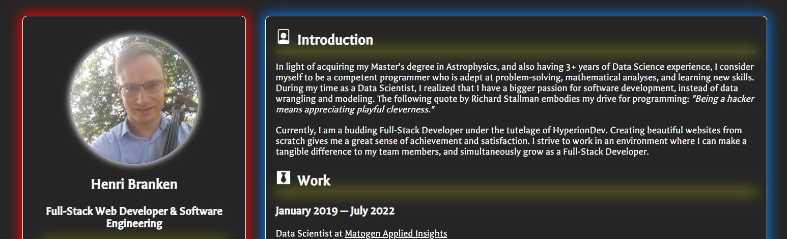

# Abridged CV in React

**Table of Contents**

- [Author](#author)
- [Introduction](#introduction)
- [Installation](#installation)
- [Running the App](#running)
- [Documentation](#documentation)

## Author

<a href="https://github.com/HenriBranken" target="_blank">Henri Branken</a>

## Introduction

This app showcases the use of React Components alongside with `props` to construct a simple, static webpage. As such, it covers the fundamentals of React.

## Installation

- Navigate to the repo directory.
- From the command-line, execute **`npm install`**.
  - This will create a `node_modules` folder containing all the package dependencies.

## Running the App

After succesful installation, execute the following from the command-line: **`npm start`**. This will run the app in development mode.

Open [http://localhost:3000](http://localhost:3000) with your favourite browser to view the app.

As a side-note, it would be best to view the app in Full-Screen Mode by pressing **`F11`**.

## Documentation

See <a href="https://legacy.reactjs.org/docs/components-and-props.html" target="_blank">this</a> site to learn more about React `components` and `props`.
